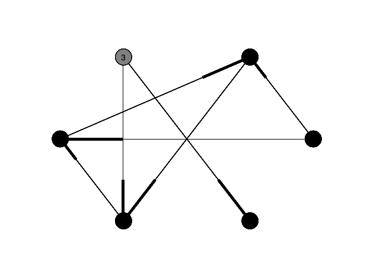
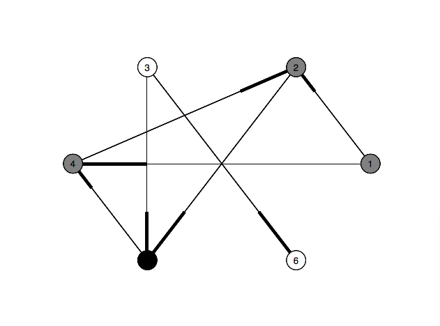

DepthFirstSearch-AnimatedTraversal
==================================

Python implementation of Depth First Search with step by step animation using networkx python library.

Usage
=====

1. Open the `@dfs.py` file and type your edges to `@graph` object.
2. Save and exit the file.
3. Run `@python dfs.py`

Screenshots
===========

www.gokhanarik.com
